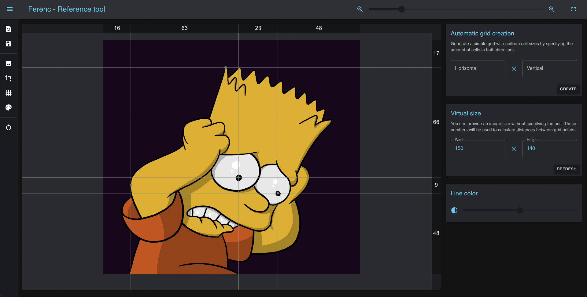

# Ferenc

Have you ever pressed your ruler to your monitor to get accurate proportions of an object? Are you struggling with converting digital image sizes to centimeters? Do you need a reference grid to help copying, but image editors are too slow, complicated or heavyweight for your need?

[Try it in your browser](https://davidsz.github.io/reference-tool)

**Ferenc** is a web based reference tool for artists who seek a ways to transfer digital images from their display to traditional media, such as paper or canvas. Based on my own needs, I created this lightweight application with the following functions:

- Importing images from the web or from the local computer
- Resize image to a desired aspect ratio
- Generate grid automatically or add helper lines manually
  - **Left click** in grid creation mode: add reference point with horizontal and vertical lines
  - **Right click** on the point: change between horizontal line, vertical line or grid point
  - **Long right click** on the point: remove
  - **Left click drag & drop**: move points
- Show image size proportions among the grid points
  - Using an unnamed measurement unit as virtual size, you can consider sizes as centimeters, millimeters or anything else
- Quick color filters (*under development*)
  - Black and white mode to check contrasts of a colored image
- Saving and loading your workflow
  - Automatical quick save to the storage memory of your browser
  - Manual save to a file
- Distraction free mode
